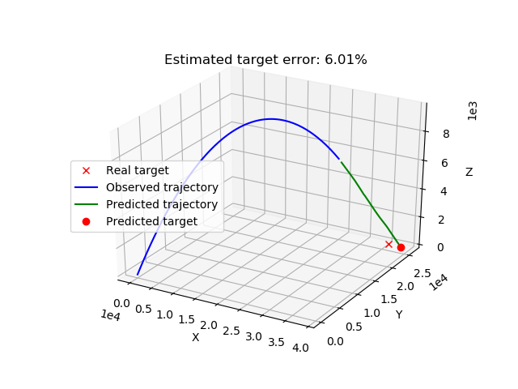
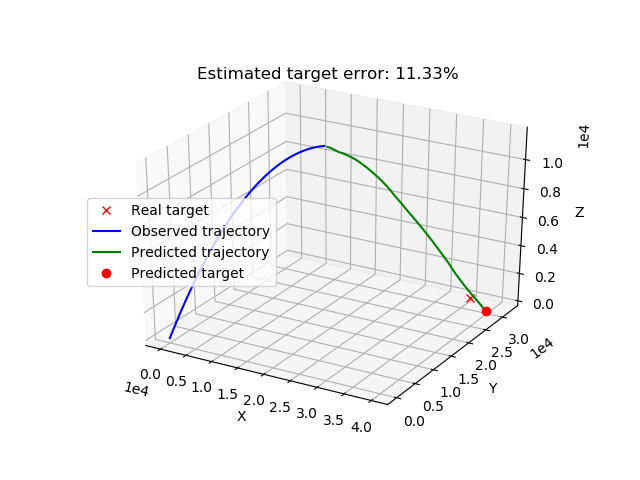
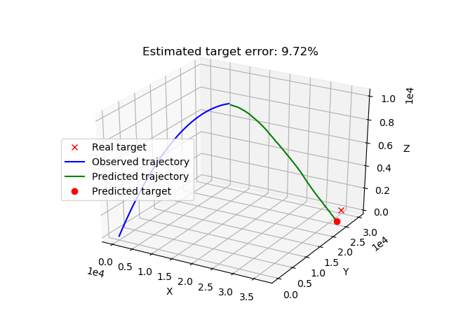

# Trajectory Prediction using LSTM

## The Problem
We wish to predict the continuation of a given trajectory in 3D space. A trajectory is given as a set of (x,y,z) coordinates, representing some motion in space. In our case, we used standard ballistic trajectories.
We want to predict the continuation of the trajectory. Since an artificially predicted trajectory continuation is a trajectory itself, in theory a trajectory could be predicted forward in time until infinity. Practically, we will attempt to predict the continuations of trajectories that haven't yet touched the ground (z=0), until they do. 

## Our Solution
We use an LSTM network that receives three vectors of x,y,z coordinates, and outputs three vectors of x,y,z predictions. The vectors of both the inputs and outputs are variable. For instance, one can choost to predict one time step forward (len(x_predicted)=1), by examining the ten previous time steps (len(x_input)=10). One can also predict multiple time steps ahead if desired.

Our model is sequential, and uses the following layers: LSTM, RepeatVector, LSTM, TimeDistributed. We use relu as an activation function for both LSTM layers, and the 'adam' optimizing method with 'mse' loss function.

### Training
Our LSTM network is trained on a large set of trajectories that vary in their initial speed and angle. A single trajectory is a NX3 matrix, where N is the length of the trajectory, in time steps. A trajectory dataset is a matrix of size NX3*M, and holds M trajectories. This dataset is saved as a csv file in our project, and is generated randomly at the start of an operation.
The model can save or load its weights to avoid needless retraining. However, keep in mind that the weights fit a specific number of predicted points, and number of points to predict from. If you change this number (say you want to use 6 points to predict 1 instead of 3 points to predict 1), you need to retrain.

## Testing
As a test, our model accepts a trajectory of some length, and disregards all of it except the last few points. The number of points it uses is the length of the input vector. I.e, if the model uses 3 points to predict 2 points forward, and the model is tested on a 100 point long trajectory, it will only use points 97, 98, 99 to predict points 100, 101.
Practically, we want to continue the trajectory until z=0, but we don't know how many steps forward that will be. Instead, we predict only one point forward, and then retry until the ground is reached.

#### Example
Let's say we have an input trajectory with 100 points [p0..p99], each point has 3 coordinates- x,y,z. We train our model to predict one step forward, using the last three points. Testing our podel on p, it takes p97, p98, p99 and predicts a new point p100. We check to see if the z coordinate of p100 has reached zero or below, and if not, we retest the model using p98, p99, p100 to predict a new point p101. We repeat these steps until the ground is hit.

## General Information
We use trajectories that mimic a ballistic trajectory from Gaza to Be'er Sheva (roughly 40km). We train our model on 1000 trajectories, and test it on a new randomly created trajectory. We compare the predicted point of impact with the true point of impact, inferred by the trajectory creator analytically. The distance between the true impact point and predicted impact point is divided by the true impact point distance from the point of origin, and the result is the error of prediction we report.
The RMS error reported in training represents the average euclidean distance between the last predicted point, to the true point, in a training set.

## How to Run?
Press F5 on the "Main.py" file. That's it.
If you want to play around with it, you can change the following trajectory parameters:
1. "dt" is the time difference between two timesteps (two observation points)
2. "time_interval" is the duration of the trajectory
3. "initial_speed_interval" is the initial speed interval, within which a speed is randomly selected
4. "initial_angleAZ_Interval", "initial_angleAl_Interval" are the initial trajectory azimuth and elevation angles intervals, respectively. The initial angles are selected from within these intervals randomly.
5. "input_size" is the number of observation points from which the model will attempt to make a prediction
6. "output_size" is the number of sequential obserations points the model will predict